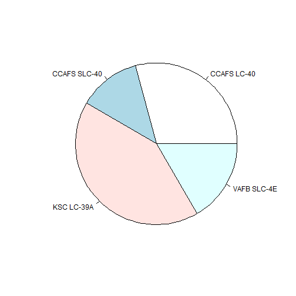
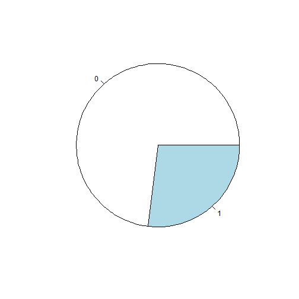

LandingSuccess
========================================================
author: Gradon Kam
date: 2/2/2022
autosize: true

SpaceX Launch Data
========================================================

This app contains data from a small dataset of SpaceX first stage landings.
- The app shows the successful first stage landings split up by landing site in a pie chart.
- When an individual site is selected, the pie chart changes to show successes vs failures.

Background
========================================================

SpaceX is known for saving money based on the ability to land and reuse the first stage of their rockets.

This app takes a dataset of the landing successes and failures and shows success rates for each launch site. Certain sites may be more or less successful options for landing a booster and allowing the booster to be reused.

Chart for Successes at All Sites
========================================================

This chart is the example for all sites, showing the successes for each site - but does not include success/failure rate, only the absolute number of successes for each site.

Chart for site CCAFS LC-40 (Cape Canaveral)
========================================================

This chart shows the success rate for Cape Canaveral (CCAFS LC-40). 0's are failures and 1's are successes. As this chart shows, the success rate for landing a rocket launched from this site is slightly better than 25%.

Other launch site success rates can be found through the app dropdown.

